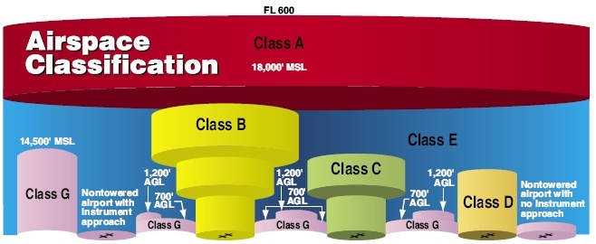
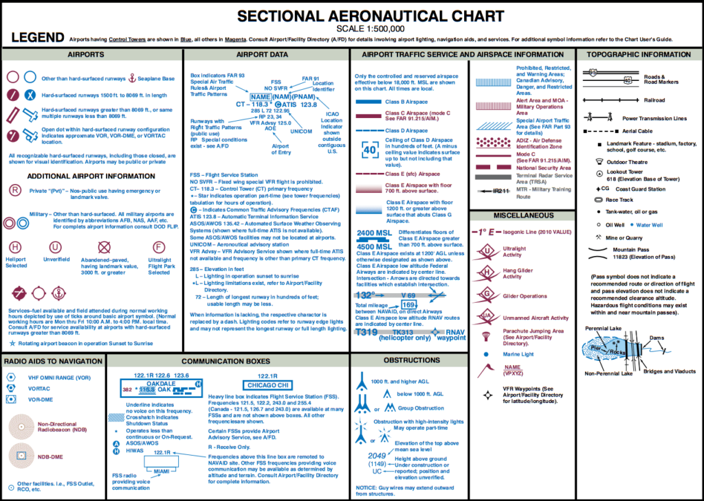

@title[unmanned aerial systems regulatory considerations]
### unmanned aerial systems (uas)
### regulatory considerations
###### D.J. Biddle, GISP
---
@title[the plan]
#### the plan
- How we got here (the evolution of drone regulations)
- FAA Part 107 Overview
- Operating Limitations
- Part 107 Licensing
- Airman's Knowledge 
- Resources for further study  
---
@title[how we got here]
#### how we got here...
Since the early 20th century, drones have been used by the military and by **hobbyists**.  
  
For decades, training and operating procedures were driven by community organizations like the **Academy of Model Aeronautics**.  
+++
@title[how we got here]
#### how we got here...
The **AMA** designed training programs for the operation of small model aircraft, which were largely powered by gasoline engines. 
+++
@title[how we got here]
#### how we got here...
As the popularity of model aircraft grows, the federal government sees the need to regulate.  
  
@css[fragment](In the mid 2000s, Congress officially acknowledges the community organization training model as best practice for **non-commerical** use...)  
  
@css[fragment](but the Federal Aviation Administration bans commercial use!)
+++
@title[how we got here]
#### how we got here...
The FAA establishes [**Advisory Circular 91-57, Model Aircraft Operating Standards**](https://www.faa.gov/regulations_policies/advisory_circulars/index.cfm/go/document.information/documentID/1028086), permitting model aircraft use up to 400ft AGL with the following (voluntary) guidelines... 
+++ 
@ol
- The aircraft is flown strictly for hobby or recreational use 
- The aircraft operates in accordance with a community-based set of safety guidelines and within the programming of a nationwide community-based organization (CBO) 
- The aircraft is limited to not more than 55 pounds 
- The aircraft operates in a manner that does not interfere with, and gives way to, any manned aircraft 
- w/i 5 miles of an airport, the operator of the model aircraft provides the airport operator or ATC with prior notice of the operation 
@olend
+++ 
@title[how we got here]
#### how we got here...
Still no commercial operations!
+++
@title[how we got here]
#### how we got here...
The need for commercial UAS operations grows, and legal battles between users and the FAA erupt...  
  
https://www.houstonchronicle.com/news/houston-texas/houston/article/Feds-order-EquuSearch-to-stop-using-drones-in-5385967.php 
+++
@title[how we got here]
#### how we got here...
##### public COA
To permit limited commercial uas operations, the FAA begins issuing **[Certificates of Waiver or Authorization](https://www.faa.gov/about/office_org/headquarters_offices/ato/service_units/systemops/aaim/organizations/uas/coa/) (COAs)**.  
  
@css[fragment](COAs can be granted to public organizations for flight in special airspace, or in special situations...)  
  
@css[fragment](A lengthy and rigorous application process limited the issuance of COAs...)@css[fragment](and they typically were issued for a limited duration or area)

Note: 
- COA requires a public sponsor.
- Private company must partner with a public entity. 
+++
@title[how we got here]
#### how we got here...
##### Section 333 Exemptions
Powerful business entities (Amazon anyone?) begin to lobby for clearer and more efficient regulations.  
  
@css[fragment](The FAA Mondernization and Reform Act of 2012 includes Section 333, providing a means for legal commercial operations without a public partner...)  
  
@css[fragment](Section 333 exemptions are more flexible than COAs, with fewer flight area restrictions...)  
+++  
@css[fragment](But still require a lengthy and cumbersome application process)  
  
@css[fragment](and REQUIRES an FAA licensed pilot of sport rating or higher!)

Note: 
- Section 333 acts as a temporary solution while the FAA can consider more substantive solutions...eventually leading to Part 107. 
- For years, the regulatory landscape is uncertain for small businesses, and for government entities, who were restrcited from pursuing Section 333 exemption. 
- ALL commercial operations require the supervision of an FAA licensed pilot! 
+++
@title[how we got here]
#### how we got here...
##### Part 107
Since June of 2016, [Part 107 of the FAA Code of Federal Restrictions (CFR)](https://www.ecfr.gov/cgi-bin/text-idx?SID=e331c2fe611df1717386d29eee38b000&mc=true&node=pt14.2.107&rgn=div5) lowers the barriers to entry in the commerical UAS sphere.  
  
@css[fragment](Part 107 defines the operating limitations of small UAS systems under 55lb...)@css[fragment](and establishes the Remote Pilot in Command certification)  
  
@css[fragment](individuals can now seek certification to fly UASes commercially without a lengthy and cumbersome application)
+++
@title[how we got here]
#### how we got here...
##### COA vs Section 333 vs Part 107 
   
https://jrupprechtlaw.com/section-333-exemption-vs-part-107-vs-public-coa-one-choose 
+++
@title[part 107 overview]
### Part 107 Overview 

@ul
- < 55lb
- <= 400ft AGL (or 400ft above structure)
- Not interfere with airport/heliport operations
- Daytime only (30 min before sunrise/30 min after sunset)
- VLOS only
- 3+ miles visibility
@ulend

Note: 
- Let's take a look at the major guidelines of Part 107, and understand how they apply to our operations

+++
@ul
- Yield right of way to manned aircraft
- No flight over non-participating people
- No operations from moving aircraft
- No operations from moving vehicle (unless in a remote area)
- Flight in airspace other than "G" requires ATC **permission**
- Operations supervised by rPIC certificate holder
@ulend

Note: Looking at the Part 107 restrictions, we see a couple of themes emerge...airspace, weather, decision making, airport operations, communications, etc.
---  
@title[part 107 certification]
##### [Part 107: Remote Pilot Certification](https://www.faa.gov/uas/commercial_operators/become_a_drone_pilot/) 
@ol
- Be 16 years of age
- Pass a Security Threat Assessment (STA) by the TSA
- Pass an initial knowledge test
- Every 24 months...pass a recurrent knowledge test
@olend
+++
##### Part 107 Knowledge Test
60 questions. 120 minute time limit.  
  
@css[fragment](Must pass with a 70%...42 questions correct)
+++
##### Part 107 Knowledge Test
Covers...
@ul
- sUAS regulations
- Airspace Classifications
- Aviation weather
- sUAS loading and performance
- Operations (emergency procedures, crew management, decision-making, airport operations, communications, etc)
-@ulend
+++
##### Part 107 Knowledge Test
##### Airspace Classifications
The **National Airspace System** defines the airspace, navigation systems and airports that comprise the aviation infrastructure in the United States.  
  
The atmosphere is divided into a series of airspace classes with unique rules about aircraft operations within them.
+++
##### Part 107 Knowledge Test
##### Airspace Classifications
- **Class A**: A for altitude! 18,000ft MSL and above
- **Class B**: B for busy! Around the nation's busiest airports. (Think JFK/ORD)
- **Class C**: C for crowded! Around major airports, but not the busiest. (Think SDF)
- **Class D**: D for dialog! Around airports with a control tower to talk to. (Think LOU)
- **Class E**: E for everywhere!...that isn't A, B, C, D, or G.
- **Class G**: G for ground! All airspace from the surface to 1,200ft AGL that isn't A, B, C, or D. 
+++
##### Part 107 Knowledge Test
##### Airspace Classifications

+++
##### Part 107 Knowledge Test
##### Airspace Classifications
Where do sUAS fly?  

@css[fragment](Mainly class...)@css[fragment](**G!**)    
  @css[fragment](Up to 400ft AGL)  
@css[fragment](Maybe class...)@css[fragment](**B, C, or D!**)  
  @css[fragment](With ATC permissions)  
@css[fragment](Rarely class...)@css[fragment](**E**!)  
  @css[fragment](If flying around tall structures/uncontrolled airports)  
@css[fragment](Never class...)@css[fragment](**A!**)  
  @css[fragment](Far too high. Breaks VFR and VLOS requirements)  
+++
##### Part 107 Knowledge Test
##### Airspace Classifications: Sectional Charts
<iframe class="stretch" data-src="https://skyvector.com/?ll=38.22554539698933,-85.70571898828656&chart=301&zoom=1"></iframe>
+++
##### Part 107 Knowledge Test
##### Airspace Classifications: Sectional Chart Legend

+++

 

 

